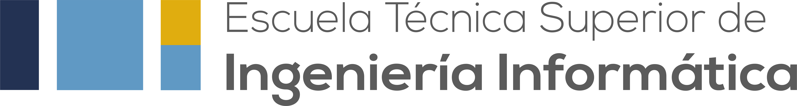

<div align="center">
  

  # Permutas ETSII

  **La plataforma web que simplifica las permutas de grupo en la ETSII.**

  Centraliza solicitudes, coincidencias, documentación, incidencias y gestión académica
  en una experiencia accesible para estudiantes, Delegación y administración.

  [](https://react.dev/)
  [](https://vite.dev/)
  [](https://vitest.dev/)
  [](#una-experiencia-pensada-para-cada-rol)

  [Ver la aplicación](https://permutas.eii.us.es) ·
  [Comunicar un problema](https://github.com/TFGfraanicardandorsan/TFMFrontEnd/issues) ·
  [Proponer una mejora](https://github.com/TFGfraanicardandorsan/TFMFrontEnd/pulls)
</div>

> [!NOTE]
> La aplicación pública utiliza autenticación institucional. Para ejecutar el proyecto
> completo en local se necesita un backend compatible y una sesión SAML válida.

## ¿Qué es Permutas ETSII?

Permutas ETSII nace para convertir un proceso disperso y manual en un flujo único,
trazable y fácil de seguir. Un estudiante puede indicar sus asignaturas y grupos,
buscar intercambios compatibles y generar la documentación necesaria sin salir de la
plataforma. Los equipos responsables disponen, a su vez, de herramientas específicas
para supervisar la actividad, atender incidencias y gestionar datos académicos.

### Lo más destacado

- Gestión completa de solicitudes y propuestas de permuta.
- Generación, descarga y firma electrónica de documentos PDF.
- Seguimiento de incidencias con archivos adjuntos.
- Paneles diferenciados y rutas protegidas por rol.
- Notificaciones, estadísticas y gestión de feedback.
- Interfaz responsive, modo claro/oscuro y traducciones en español, inglés y francés.
- Protección CSRF y autenticación basada en cookies de sesión.

## Una experiencia pensada para cada rol

| Rol | Qué puede hacer |
| --- | --- |
| **Estudiante** | Configurar estudios, asignaturas y grupos; solicitar o aceptar permutas; consultar el estado del proceso; generar documentación; reportar incidencias y enviar feedback. |
| **Administración** | Gestionar usuarios, grados, asignaturas y grupos; publicar notificaciones; resolver incidencias; consultar estadísticas y hacer seguimiento de sugerencias. |
| **Delegación** | Generar certificados desde CSV, firmarlos en lote con AutoFirma y preparar su distribución por correo o Telegram. |

### Flujo de una permuta

1. El estudiante configura su perfil académico y su grupo actual.
2. Publica una solicitud indicando los grupos que desea.
3. La plataforma muestra solicitudes y propuestas compatibles.
4. Las partes aceptan la permuta y generan la documentación correspondiente.
5. El proceso queda disponible para seguimiento y validación.

## Tecnologías

| Área | Herramientas |
| --- | --- |
| Interfaz | React 18, CSS y Font Awesome |
| Entorno de desarrollo | Vite 6 y ESLint |
| Navegación y seguridad | React Router, rutas por rol, sesiones SAML y tokens CSRF |
| Internacionalización | i18next y react-i18next |
| Documentos | pdf-lib, FileSaver.js y AutoFirma |
| Visualización | Chart.js y react-chartjs-2 |
| Experiencia de usuario | React Toastify, Swiper, tema oscuro y diseño responsive |
| Pruebas | Vitest, Testing Library y jsdom |

## Arquitectura del frontend

```text
src/
├── components/        # Pantallas agrupadas por estudiante, administración y Delegación
├── contexts/          # Estado global de autenticación y tema
├── hooks/             # Hooks reutilizables
├── layouts/           # Navegación y estructura visual para cada rol
├── lib/               # CSRF, validación, traducciones y utilidades de dominio
├── locales/           # Recursos de idioma: español, inglés y francés
├── routes/            # Protección de rutas autenticadas y autorización por rol
├── services/          # Integración con la API, archivos, AutoFirma y certificados
└── styles/            # Estilos globales y específicos de cada módulo
```

La interfaz consume una API HTTP mediante `fetch`, enviando las cookies de sesión en
las peticiones. Las operaciones que modifican datos incorporan automáticamente el
token CSRF solicitado al backend. La autorización visual se aplica mediante layouts y
rutas específicas para cada rol; el backend debe validar siempre los permisos reales.

## Puesta en marcha

### Requisitos

- [Node.js](https://nodejs.org/) 20 LTS recomendado.
- npm, incluido con Node.js.
- Un backend compatible con los endpoints `/api/v1`.
- Acceso a la autenticación SAML para probar el flujo completo.

### Instalación

```bash
git clone https://github.com/TFGfraanicardandorsan/TFMFrontEnd.git
cd TFMFrontEnd
npm install
```

Crea un archivo `.env` en la raíz cuando el backend no se sirva desde el mismo origen:

```dotenv
VITE_API_URL=http://localhost:3000

# Integración opcional con el servicio de certificados de Delegación
VITE_DLGA_API_URL=/api/v1/delegados
VITE_DLGA_PUBLIC_URL=http://127.0.0.1:8001

# Opcional: sobrescribe el script de AutoFirma fijado por el proyecto
# VITE_AUTOFIRMA_SCRIPT_URL=https://example.com/autoscript.js
```

> [!IMPORTANT]
> `VITE_API_URL` debe ser únicamente el origen del backend, sin añadir `/api/v1`.
> Si frontend y API comparten origen, puede dejarse vacío.

Inicia el servidor de desarrollo:

```bash
npm run dev
```

Vite sirve el proyecto en [`http://localhost:3033`](http://localhost:3033), de acuerdo
con la configuración actual del repositorio.

## Comandos disponibles

| Comando | Descripción |
| --- | --- |
| `npm run dev` | Inicia el servidor de desarrollo con recarga en caliente. |
| `npm run build` | Genera la aplicación optimizada en `dist/`. |
| `npm run preview` | Sirve localmente la compilación de producción. |
| `npm run lint` | Analiza el código con ESLint. |
| `npm test` | Ejecuta las pruebas con Vitest en modo interactivo. |
| `npm test -- --run` | Ejecuta una sola pasada de toda la suite. |
| `npm run test:ui` | Abre la interfaz visual de Vitest. |

## Integraciones y consideraciones

- **Backend:** este repositorio contiene solo el frontend; varias pantallas necesitan
  respuestas y sesiones proporcionadas por la API.
- **SAML:** el acceso de producción está vinculado al proveedor de identidad
  institucional.
- **AutoFirma:** la firma electrónica requiere la aplicación cliente y la interacción
  del usuario. El script predeterminado está fijado a una versión e integridad
  concretas.
- **Certificados de Delegación:** el desarrollo local puede redirigir `/dlga-api` al
  servicio configurado mediante `VITE_DLGA_PROXY_TARGET`. Esta variable se lee al
  cargar la configuración de Vite y debe pasarse en el entorno del proceso, por
  ejemplo: `VITE_DLGA_PROXY_TARGET=http://127.0.0.1:8001 npm run dev`.
- **Feedback:** el contrato esperado por el frontend está descrito en
  [`docs/feedback-api.md`](docs/feedback-api.md).

## Cómo contribuir

Las propuestas que mejoren la accesibilidad, la experiencia de usuario, la cobertura
de pruebas o la mantenibilidad son bienvenidas.

1. Crea un fork del repositorio.
2. Abre una rama descriptiva: `git switch -c feat/mi-mejora`.
3. Implementa el cambio y añade o actualiza las pruebas necesarias.
4. Ejecuta `npm test -- --run`, `npm run lint` y `npm run build`.
5. Abre un pull request explicando el problema, la solución y cómo verificarla.

Para errores reproducibles, abre una
[`issue`](https://github.com/TFGfraanicardandorsan/TFMFrontEnd/issues) e incluye los
pasos, el resultado esperado, el resultado obtenido y, si es posible, una captura.

## Licencia

El repositorio todavía no incluye un archivo `LICENSE`. Antes de reutilizar o
redistribuir el código, consulta las condiciones con el equipo responsable del
proyecto.

## Contacto

**Delegación de Alumnos de la ETSII — Universidad de Sevilla**<br>
Avda. Reina Mercedes s/n, 41012 Sevilla<br>
[delegacion_etsii@us.es](mailto:delegacion_etsii@us.es)

---

<div align="center">
  Hecho para facilitar la coordinación académica en la ETSII.
</div>
